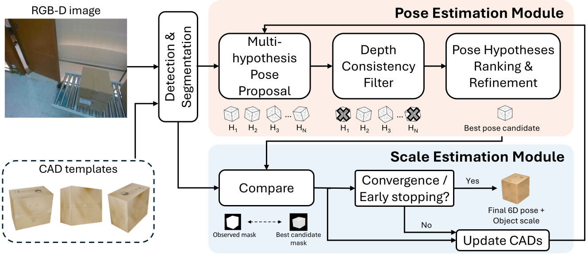
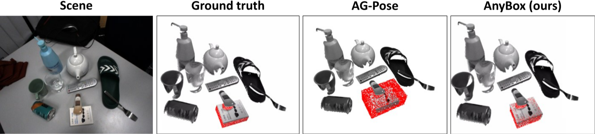

<div align="center">

# AnyBox
### Efficient Zero-Shot 9DoF Pose Estimation of Boxes for Robotic Manipulation

**ECCV 2026 R6D Workshop**

Yintao Ma, **Sajjad Pakdamansavoji**, Charles Eret, Rui Heng Yang, Xuan Zhao, Yingxue Zhang, Tongtong Cao, Amir Rasouli

¹Huawei Technologies Canada · ²University of Waterloo

[](https://arxiv.org/abs/2511.15884)
[](https://sajjadpsavoji.github.io/AnyBox/)
[](https://huggingface.co/papers/2511.15884)
[](LICENSE)

</div>



---

> **Note**
> This repository is a placeholder. The paper and project page are live; **code release is in progress**.
> Watch or star the repo to be notified when it lands.

## Abstract

Recovering the 9D pose of objects, both their 6D pose and 3D dimensions, under clutter and occlusion is a core requirement for warehouse automation, logistics, and manufacturing. Model-based methods are accurate but assume an instance-specific CAD model for every object, which is costly to maintain as inventories change. Model-free and category-level methods relax this assumption, yet they remain vulnerable to the symmetry, weak texture, and heavy occlusion that characterize stacked storage boxes, and they ignore the strong structural priors such scenes provide. We present AnyBox, an efficient zero-shot framework that exploits the geometric regularity of boxes to jointly recover pose and dimensions from a single RGB-D observation. Starting from a canonical category template, AnyBox alternates between pose and scale estimation, using the discrepancy between the reprojected template and the observed mask to drive a binary search over box dimensions. Two lightweight components make this practical: a depth-consistency filter that rejects the implausible hypotheses induced by box symmetry, and an early-stopping rule that replaces the remaining search with a single closed-form update. On public benchmarks and an in-house warehouse dataset, AnyBox improves detection AP by up to 36 points, more than doubling the previous best, and approaches instance-level pipelines that have access to ground-truth CAD models. These gains transfer downstream, raising success by 28% on a cluttered robotic box-shelving task.

## News

- **2026-09** &mdash; Paper released on [arXiv](https://arxiv.org/abs/2511.15884) and indexed on [Hugging Face](https://huggingface.co/papers/2511.15884).
- **2026-09** &mdash; Project page live at [sajjadpsavoji.github.io/AnyBox](https://sajjadpsavoji.github.io/AnyBox/).

## Getting Started

_Code coming soon._ The intended entry point:

```bash
git clone https://github.com/SajjadPSavoji/AnyBox.git
cd AnyBox
pip install -r requirements.txt
```

## Results



_Add a quantitative results table here._

## Citation

If you find this work useful, please cite:

```bibtex
@article{ma2025anybox,
  title   = {AnyBox: Efficient Zero-Shot 9DoF Pose Estimation of Boxes for Robotic Manipulation},
  author  = {Yintao Ma and Sajjad Pakdamansavoji and Charles Eret and Rui Heng Yang and Xuan Zhao and Yingxue Zhang and Tongtong Cao and Amir Rasouli},
  journal = {arXiv preprint arXiv:2511.15884},
  year    = {2025}
}
```

## Links

- 📄 [Paper (arXiv)](https://arxiv.org/abs/2511.15884)
- 🌐 [Project page](https://sajjadpsavoji.github.io/AnyBox/)
- 🤗 [Hugging Face](https://huggingface.co/papers/2511.15884)
- 👤 [Google Scholar](https://scholar.google.com/citations?user=DZzLzNwAAAAJ)
- 💼 [LinkedIn](https://www.linkedin.com/in/sajjad-pakdaman-savoji/)

## Acknowledgements

*Equal contribution · †Corresponding author · ‡Work done while at Huawei

## License

Released under the [MIT License](LICENSE).
